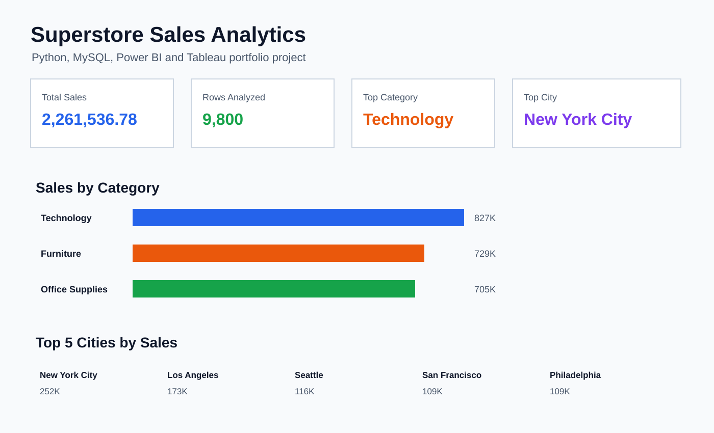
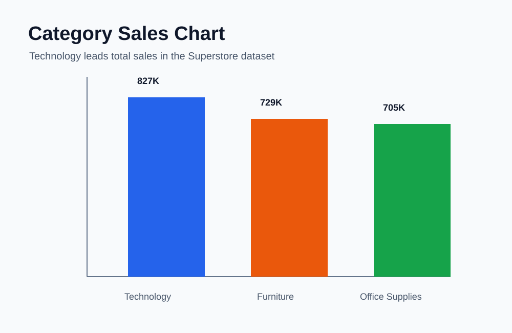

# Superstore Sales Analytics Project

End-to-end sales analytics project using Python, MySQL, Power BI, and Tableau on the Superstore sales dataset.

## Project Overview

This project analyzes retail sales performance across categories, cities, and months. The goal is to move from raw CSV data to business insights using multiple analytics tools:

- Python for data loading, cleaning, exploration, and quick visualization
- MySQL for SQL-based business queries
- Power BI for interactive dashboard building
- Tableau for an additional business intelligence dashboard view

## Key Insights

- Total records analyzed: 9,800
- Total sales: 2,261,536.78
- Top category by sales: Technology, with 827,455.87 in sales
- Top city by sales: New York City, with 252,462.55 in sales
- Strong sales months include November, December, and September

## Tools Used

- Python
- Pandas
- NumPy
- Matplotlib
- MySQL
- Power BI
- Tableau
- Tabula

## Repository Structure

```text
assets/
  category_sales_chart.svg
  sales_summary_dashboard.svg
data/
  Superstore Sales Dataset.csv
docs/
  linkedin-post.md
notebooks/
  superstore.ipynb
powerbi/
  powerbi project.pbix
sql/
  mysql_superstore.sql
tableau/
  superstore.twb
```

## Screenshots





## Analysis Performed

1. Loaded Superstore sales data in Python.
2. Checked dataset structure and missing values.
3. Calculated total sales.
4. Analyzed sales by product category.
5. Identified the top 5 cities by sales.
6. Converted order dates into date format.
7. Analyzed monthly sales trends.
8. Repeated important business queries in MySQL.
9. Built dashboard files in Power BI and Tableau.

## How To Run

1. Clone this repository.
2. Install Python dependencies:

```bash
pip install -r requirements.txt
```

3. Open `notebooks/superstore.ipynb` in Jupyter Notebook.
4. Run the notebook cells from top to bottom.
5. Import `data/Superstore Sales Dataset.csv` into MySQL and run `sql/mysql_superstore.sql`.
6. Open the Power BI and Tableau files from their folders.

## Business Questions Answered

- What is the total sales value?
- Which product category performs best?
- Which cities generate the highest sales?
- How does sales performance change by month?
- How can the same dataset be explored using Python, SQL, Power BI, and Tableau?

## About This Project

This is my first end-to-end analytics portfolio project. It shows my ability to work with data from raw files, analyze it with Python and SQL, and present the findings using business intelligence tools.
