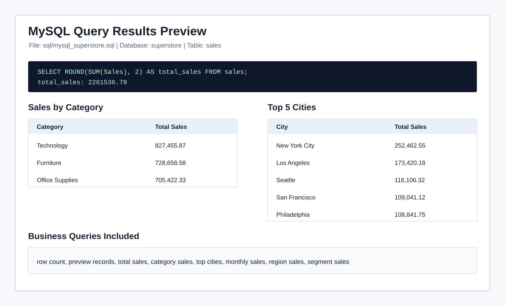

# MySQL Analysis

This folder contains the MySQL workflow for the Superstore Sales Analytics project.

## File

- `mysql_superstore.sql`

## What It Covers

- Database setup
- Optional `sales` table schema
- CSV import guidance
- Row count validation
- Total sales
- Sales by category
- Top cities by sales
- Monthly sales trend
- Region and segment performance

## Preview

